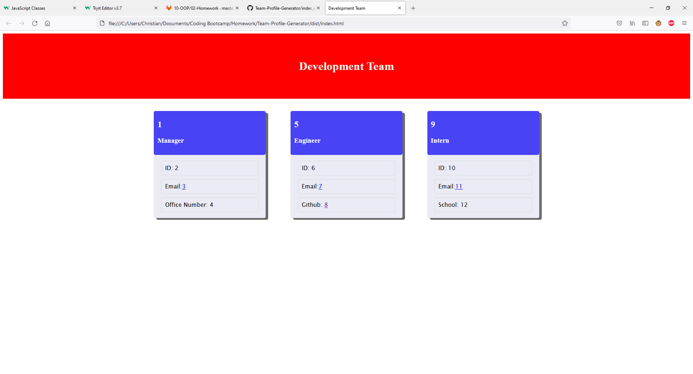

# Team-Profile-Generator

## Table of Contents
- [Description](#Description)
- [Installation](#Installation)
- [Usage](#Usage)
- [Contributing](#Contributing)
- [Links](#Links)
- [Screenshots](#Screenshots)
- [Questions](#Questions)
    
## Description
- This application creates a team and displays that team to an html page all via the cmd line of node.
    
## Installation
- Install Node.js, inquirer, and jest from npm.

## Usage
- Run the cmd "node index.js" from the cmd line of a terminal to create the application
- Run the cmd "node test" from cmd line of a terminal to run tests

## Contributing
- Christian Tanicala

## Links
- https://github.com/Chtanicala/Team-Profile-Generator (Repository)
- https://github.com/Chtanicala/Team-Profile-Generator/blob/main/index.js (Index.js File)
-  (App Video)
-  (Test Video)

## Screenshots
- 

    
## Questions
- Contact username, Chtanicala, on Github
- Email christian.tanicala@gmail.com